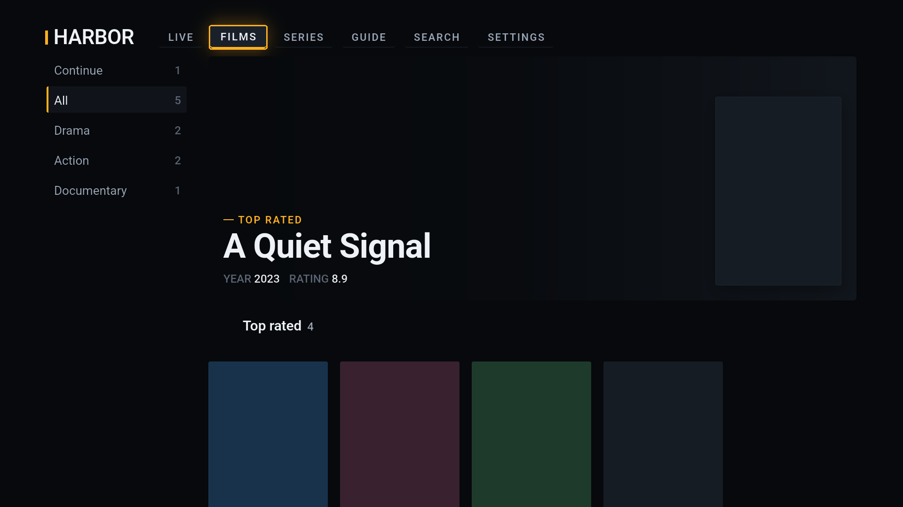
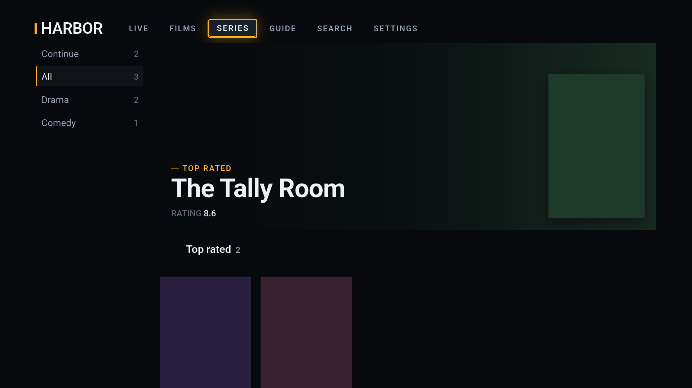

# OpenTV

Software that can entirely be built with AI should never be sold for profit. This is an IPTV player built entirely by Claude Code in a day to fix my frustration with all the paid apps out there. You are welcome to fork this project or PR any changes you'd like to add.

---

**OpenTV supplies no channels, films or playlists. It hosts no content and
transmits none.** Everything you see in it comes from a provider you choose
and an address you enter. You are responsible for holding the rights to
whatever you connect it to.

It runs on **Android TV, Apple TV, Android phones and tablets, and iOS** —
one codebase, two interfaces. The app asks the operating system which machine
it is on and draws the ten-foot one or the touch one; there is no setting for
it and no wrong answer to pick.



## What it does

**Providers**

- Xtream Codes portals and M3U/M3U8 playlists
- Several providers at once, switched from settings, each with its own
  catalogue, favourites and history
- XMLTV guide data, picked up automatically from a playlist's own `x-tvg-url`
- Set up from a phone browser instead of the remote — the television serves a
  form on your network for as long as setup is open
- Or set the app up on your phone and hand the whole thing to the television:
  providers, their stored passwords, the catalogue and your history
- Forget a provider, and its stored password goes with it

**Watching**

- Live channels, films and series, each with its own browse screen
- A guide with catch-up: select something that has already aired and it plays
  from the provider's archive
- Continue watching, across all three kinds — including series, which resume
  at the episode you stopped in
- Favourites
- Search across channels, films and series at once, with a drawn keyboard that
  also accepts typing from a phone

**The player**

- Media3 on Android, libVLC on Apple TV, behind one written contract
- 4K and HDR10/HLG straight to the panel — no texture copy, no SDR compositing
- Audio and subtitle track selection; subtitles rendered on both platforms
- Four picture modes, and a readout saying which of them will actually differ
  for the material playing
- Seek by scrubbing, accelerating as you hold
- Next episode, as a button and as a card when one ends
- Channel zapping bounded by the list you are browsing
- The screen stays awake while something plays, and only while something plays

**Settings**

- Account: expiry, connections in use, catalogue counts. Never the password
- Hide categories, in bulk, one kind at a time
- Hide regions — providers put `AR`, `TR`, `EX-YU` in front of a title, and
  hiding a category cannot express "not those"
- A parental PIN that removes locked categories rather than greying them out,
  from browsing, search and the guide alike
- A TMDB key for synopses, cast and artwork — accepts either credential TMDB
  issues
- A WireGuard tunnel (Android), up on launch and down when the app leaves
- Re-read the catalogue from the provider



## Architecture

Three packages, ~38,000 lines of Dart and ~1,900 of Kotlin and Swift.

```
apps/opentv          The Flutter app
  lib/app/…          The ten-foot interface, navigation, platform channels
  lib/mobile/…       The touch interface
  android/…          Kotlin: Media3 player, keystore, WireGuard tunnel
  apple/…            Swift compiled into BOTH Apple targets
  tvos/  ios/…       The two Xcode projects
packages/opentv_core Pure Dart, no Flutter: everything testable without a device
packages/opentv_ui   Widgets, design tokens, the focus system, the touch set
```

**`opentv_core`** holds the parts that have nothing to do with a screen —
`store` (drift/SQLite, schema v4), `xtream`, `playlist`, `epg`, `sync`,
`metadata` (TMDB), `vpn` (WireGuard config), `setup` (the local server),
`handover`. It imports no Flutter, which is why 463 of its tests run in
seconds on a laptop — and why adding phones cost it nothing at all. Not one
line of it knew what a television was.

### One app, two interfaces

`Host.deviceClass()` asks the operating system, before the first frame, and
the answer decides which interface exists.

Dart cannot work it out. `Platform.isIOS` is **true on tvOS**, so an Apple TV
and an iPhone are the same device from inside Flutter — and the screen does
not separate them either, because an Android TV reports 960×540 logical pixels
and a tablet in landscape can report the same shape. `UiModeManager` and
`UIUserInterfaceIdiom` know, because they are what decided which home screen
to launch.

The two are not ports of each other. A d-pad moves between neighbours, so
shelves under a hero suit it; a thumb flicks a column and taps what it lands
on, so the same catalogue is a grid and a list. The type and spacing scales
are separate for the same reason: 1920×1080 at three metres and 400 pixels at
thirty centimetres are different problems, not one problem at two
magnifications.

### One player contract, two engines

Android uses Media3, Apple TV uses libVLC. Both answer the same method channel
— `play`, `pause`, `stop`, `state`, `tracks`, `selectTrack`, `seek`,
`setAspect` — and return the same state keys. Dart never learns which is
underneath.

The contract is written down in `PlayerContract` and checked by a test that
reads both native source files. This exists because the failure it catches is
invisible otherwise: `invokeMethod` on a platform that never implemented a
method returns silence, which looks exactly like a method that ran and did
nothing. Pause shipped doing nothing on tvOS that way, and seek was missing
from both engines until the contract named it.

### Why the video is a SurfaceView

Flutter's default platform-view mode cannot host a `SurfaceView`, so the first
version used a `TextureView`. That breaks 4K twice over: a `TextureView` hands
frames to the GPU as an ordinary texture and the result is composited in SDR,
so HDR comes out dim and flat; and every frame takes an extra GPU copy, which
at 3840×2160 is enough to drop frames on television silicon.

Hybrid composition (`initExpensiveAndroidView`) puts the native view in the
real Android hierarchy, where a `SurfaceView` works, can take a hardware
overlay plane, and can carry HDR to the display.

It costs something. A `SurfaceView` punches a hole through everything Flutter
painted beneath it, so the black behind the video has to be the Android
container's own background. And the video must be kept out of Flutter's focus
traversal, or focus lands on the picture — a full-screen stop with no
highlight, which the native view then holds by swallowing the presses that
would move it off.

### A fixed design canvas

An Apple TV reports 1920×1080 logical pixels. The Android TV emulator reports
960×540 for the same physical panel. Absolute sizes therefore mean different
things on each, and a body style tuned on tvOS renders at twice the relative
size on Android TV.

Responsive breakpoints are the wrong answer for a fixed viewport at a fixed
viewing distance. `TvCanvas` authors the interface once at 1920×1080 and
scales it, so every token, focus lift and safe-area inset means what it meant
when it was drawn.

### Focus is decided, not measured

Flutter's directional traversal answers "down" by finding whatever focusable
sits nearest the centre of what focus is leaving. That is right for a form and
wrong for a shelf: a hero banner is as wide as the screen, so its centre is
over the third or fourth tile of the row beneath.

`FocusColumn` keeps a handle on each section and moves focus to the first
thing inside the next one, in reading order. `FocusRow` scrolls by focus and
refuses the scroll intent outright — `NeverScrollableScrollPhysics` is not
enough on its own, because `ScrollAction` asks only whether a `Scrollable`
exists, never what its physics permit.

### Secrets

Provider passwords, the parental PIN, the TMDB key and the WireGuard
configuration live in the platform keystore. The database holds a reference
and never the secret.

Xtream builds a stream address by putting the username and password in the
path, so no stream URL is ever persisted for an Xtream source: it is assembled
at playback from the row's id and a password read from the keystore, and never
written down.

### Handing a setup between devices

Set the app up once and give it to your other devices: providers, their stored
passwords, the catalogue and your watch history, over your own network.

The database on its own would be useless on the other end. `credentialRef` is
a keystore handle and the secret has never been in the catalogue, so a copied
SQLite file arrives as a complete catalogue in which every provider points at
a keystore entry that does not exist there — it would sync, it would show, and
nothing would play. The payload is the database *plus* its secrets, which
makes this a transfer of everything the app holds, so it is encrypted with
AES-GCM under a key that only ever exists on a screen and a camera in the same
room.

A television can display a code and never read one, so the television always
displays and the phone always scans — whichever way the data then travels. The
server serves a pull and accepts a push, which is the only way a television
receives anything at all.

The phone scans in the app. The camera is asked for nothing else, no image
leaves the device, and the `opentv://` deep link still works as a fallback —
whatever camera app the phone already has opens the same code. A television
has no camera and no scanner is compiled into its build at all.

### Setting up from a phone

The television serves a form on the local network while setup is open. It
carries a provider password over plain HTTP, and the screen says so before
anyone types anything.

TLS is not the answer: a certificate nothing can verify produces a browser
warning, and teaching people to click through security warnings to reach their
own devices is worse than the problem. What works on a local network is a
short window and proof the person filling the form can see the television — a
six-digit code from a cryptographic source, five attempts, a session token
rather than the code afterwards, constant-time comparison, secrets in bodies
rather than URLs, and a `Host` check. Details in
[docs/phone-setup.md](docs/phone-setup.md).

## Building

Needs the [flutter-tvos](https://github.com/xdd666t/flutter-tvos) fork, pinned
at `v3.47.1-tvos.1.7.0`, which carries two entry points: `flutter/bin/flutter`
for Android and `bin/flutter-tvos` for Apple TV. See
[docs/toolchain.md](docs/toolchain.md).

```bash
flutter build apk --release
flutter build appbundle --release    # for Google Play
flutter test                         # in each package
```

### Signing a release

Without an upload key, release builds fall back to the debug key so that
`flutter run --release` still works — and the build says so. Google Play
refuses a debug-signed bundle, so that fallback is for local use only.

To sign properly, put your keystore somewhere outside the repository and
create `apps/opentv/android/key.properties`:

```properties
storeFile=/absolute/path/to/upload-keystore.jks
storePassword=…
keyAlias=upload
keyPassword=…
```

That file and every `*.jks` and `*.keystore` are gitignored, and must stay
that way: it carries the passwords to the key that signs everything you will
ever publish. Losing it means never updating the app under the same listing
again — back it up somewhere that is not this repository.

If you have no key yet:

```bash
keytool -genkey -v -keystore upload-keystore.jks -keyalg RSA \
        -keysize 2048 -validity 10000 -alias upload
```

Metadata needs a TMDB key, passed with `--dart-define=TMDB_KEY=…` or entered
in settings. It is never committed.

## What is not done

- **Apple TV has never been run on hardware.** Every tvOS line was written
  from documentation and checked by the contract tests and the simulator. See
  [docs/tvos-status.md](docs/tvos-status.md).
- **One language.** The machinery for others is in — `flutter_localizations`,
  an ARB template with a description on every string, and tests that lay the
  touch chrome out right-to-left. No second language is invented, and a test
  asserts that. The television's focus system does not mirror yet, which is
  written down in [docs/adding-a-language.md](docs/adding-a-language.md).
- No external player, no recording, no multi-screen.
- The tunnel is Android-only, on televisions and phones alike. iOS and tvOS
  need a Network Extension, which needs a paid developer account.

## Licence

[PolyForm Noncommercial 1.0.0](LICENSE). The source is open; commercial use is
not permitted.
